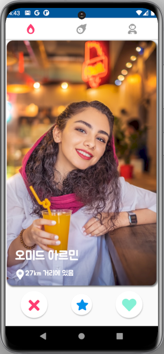
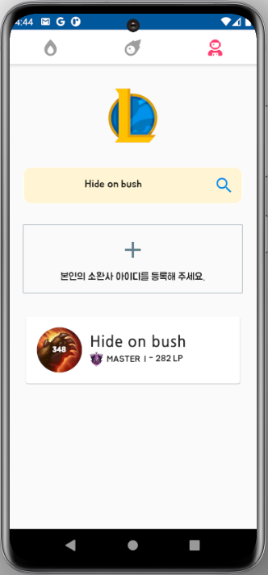

# lol Friend Flutter Project

리그오브 레전드 게임 사용자들이 팀원을 찾을 수 있습니다.  
게임 사용자끼리 함께 게임 플레이를 원할 시에 메시지를 주고 받을 수 있습니다.  
매칭 시스템은 Tinder App을 참고 하였습니다.

## Firebase 기반
핵심 기능 : 서로 좋아요 한 사람끼리 매칭, 채팅방, 리그오브레전드 전적 제공

상태관리 - Provider, Stream   
데이터베이스 - Cloud Firestore, FirebaseStorage   
Dart http 패키지로 Riot API를 사용하여 리그오브레전드 아이디 전적 검색을 구현

## Beta

10월 초에 구글 플레이스토어 베타 출시를 목표로 개발 중 👨‍💻

&nbsp;&nbsp;&nbsp;&nbsp;&nbsp;

## License
[MIT](https://choosealicense.com/licenses/mit/) 👨‍💻
